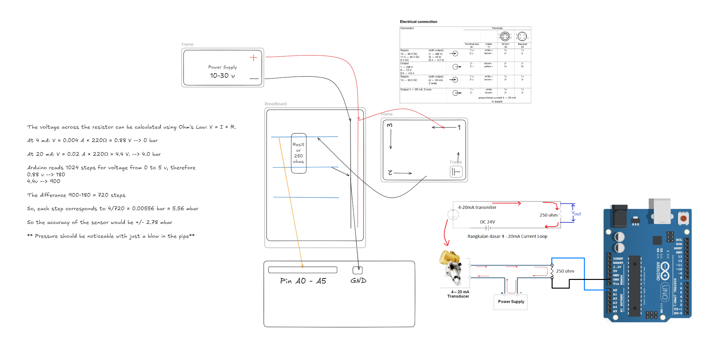

# Pressure Sensor Measurement Software

A Python-based GUI application for recording and visualizing live data from the **JUMO Midas pressure sensor**.


---

## 🚀 Getting Started

### Prerequisites

To run the software on your PC, ensure you have the following installed:

- Python (version 3.7 or later recommended)
- The following Python packages:
  - `PyQt5`
  - `pyserial`
  - `pyqtgraph`

You can install them using pip:

```bash
pip install PyQt5 pyserial pyqtgraph
```

## 📦 Installation

### Download the source code

Click the **`Code`** button at the top right of the repository page, then select **`Download ZIP`**. Extract the contents to a location on your computer.

### Run the application

- Open the extracted folder in [Visual Studio Code](https://code.visualstudio.com/) or your preferred IDE.
- Run the `main.py` file inside the src folder.

If everything is set up correctly and the required packages are installed, the GUI should launch and appear as shown in the screenshot above.

---

## ⚙️ How the Software Works

The software provides an intuitive interface for interacting with the JUMO Midas pressure sensor. Here's a brief overview of its core functionalities:

- **Device Selection:**  
  Use the dropdown menu to select the appropriate serial device connected to your sensor.

- **Live Data Visualization:**  
  The "Live View" section displays a real-time graph of the latest 50 data points, allowing you to monitor sensor output dynamically.

- **Data Logging:**  
  In the "Data Recording" section, you can save recorded data to a CSV file for further analysis or archival purposes.

- **Logs Section:**  
  Displays system messages and error logs to help with troubleshooting and understanding the software’s status.

- **COM Input (Debug Only):**  
  This section is intended for debugging and internal use. It does not play a role in regular operation.

---


## 🔌 Connecting the Sensor with Arduino

## Arduino Sensor Interface Project

## Flashing the Code to the Arduino Board

To upload the firmware to your Arduino board, follow the steps below.

### Prerequisites

- [Visual Studio Code (VSCode)](https://code.visualstudio.com/)
- [PlatformIO extension for VSCode](https://platformio.org/install/ide?install=vscode)

### Uploading the Code

1. Open VSCode and click the PlatformIO icon (a small alien head on the left sidebar).
2. Select **"Open Project"** and choose the Arduino source code folder from this repository.
3. PlatformIO will automatically initialize the project. Once it's ready, you'll see options like **"Build"** and **"Upload"** at the top of the window.
4. Click **"Upload"** to compile and flash the code onto your connected Arduino board.

## Hardware Information

- This project uses the Arduino's analog input pins **A0 to A5** to read voltage signals from connected sensors.
- You can connect up to **six sensors** simultaneously (one per pin from A0 to A5).

## Sensor Wiring

The pressure sensors used in this project output a **4–20 mA current signal**. Since Arduino analog pins can only read voltage, a conversion circuit is required to translate the 4–20 mA signal into a voltage range the Arduino can interpret.

Refer to the image below for a detailed wiring diagram:



---

Feel free to reach out or open an issue if you encounter any problems.


---

## 🙌 Credits

- **Akram Metar**  
  *akram.metar@stud.tu-darmstadt.de*

- **Anselm Brodersen**
